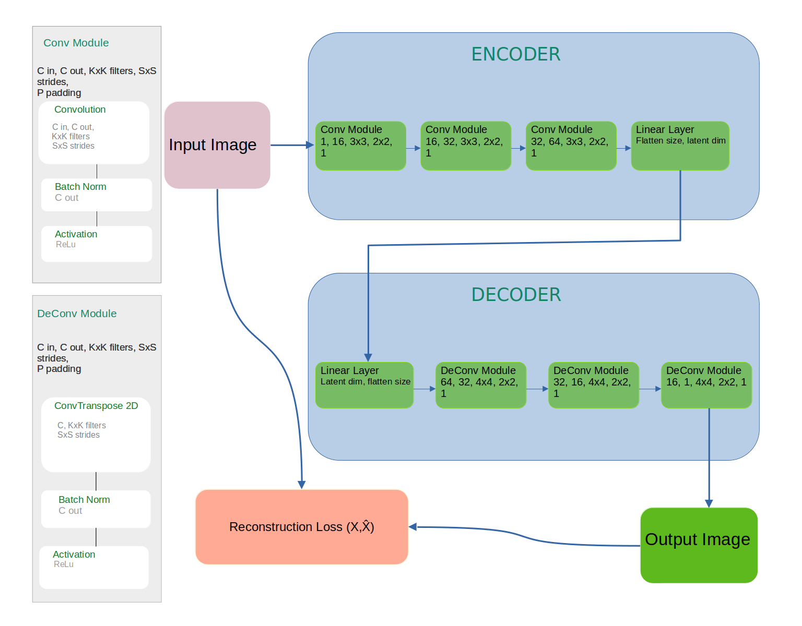

# Tumor Detection
This project applies multiple classification models, including Inception Model,
Autoencoder, Variational Autoencoder, and a Naive Method, to a dataset containing
over 12,000 samples. Comprehensive preprocessing techniques are implemented to enhance
model performance, particularly to address the localized nature of the pathology within
the dataset. This ensures a robust pipeline for effective classification.

## Naive Method
This approach utilizes simple, low-level inputs in the form of grayscale histograms derived
from MRI brain images, which are then fed into a fully connected Multi-Layer Perceptron (MLP)
for binary classification of **Tumor** and **No Tumor** samples.

1. #### Image Segmentation:
    Divide each MRI image into multiple segments both vertically and horizontally.

2. #### Feature Extraction:
    Compute grayscale histograms for each segment with a configurable number of bins.
For this implementation, 64 bins were chosen, grouping every 4 grayscale levels together,
as this configuration provided the best performance.

3. #### Feature Vector Construction:
    Concatenate the histograms of all segments to form the feature vector for the image.
The final feature vector size is calculated as 64 × h_parts × v_parts, where h_parts 
and v_parts are the number of horizontal and vertical segments, respectively.

4. #### Model Input:
    Use the concatenated feature vector as input to a fully connected MLP for classification.

##  InceptionModel

## Auto Encoder  

